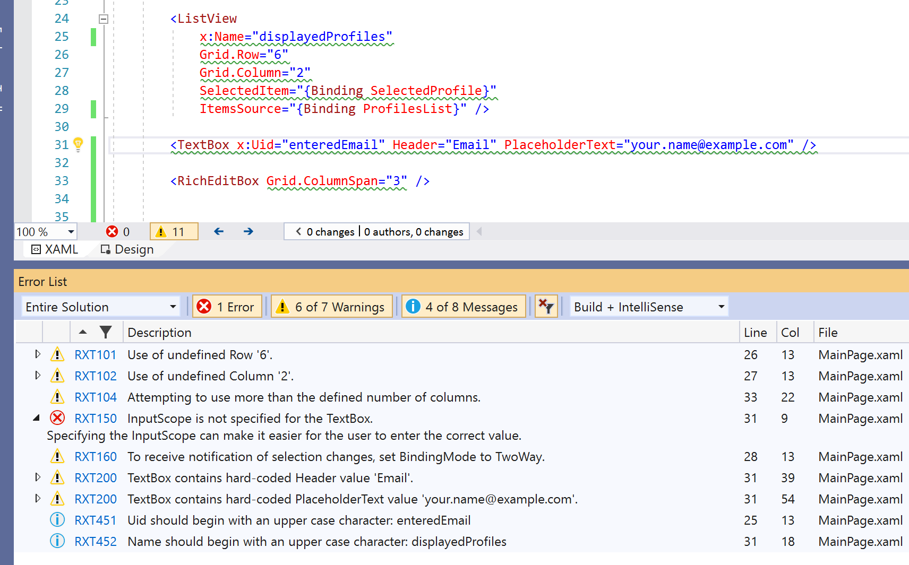

# Rapid XAML Toolkit

[](https://ci.appveyor.com/project/mrlacey/rapid-xaml-toolkit/branch/dev)
[](LICENSE)


This is a collection of tools for making it easier for developers to work with XAML (**UWP**, **WPF**, and **Xamarin.Forms**). These tools fall into two categories

- **XAML Generation** (making it easier to create a UI with XAML)
- **XAML Analysis** (helping you find and fix issues with XAML)

:heavy_exclamation_mark: **BETA** :heavy_exclamation_mark:

Consider this project as in a beta stage. There's still lots to do before it is ready for a full release and there's more functionality we want to add but we're keen to get feedback as soon as possible and focus on the features people want.

Get the preview from the [VS Marketplace](https://marketplace.visualstudio.com/items?itemName=MattLaceyLtd.RapidXamlPreview)

## XAML Generation

Creating a XAML UI can be slow and require a lot of manual effort. These tools reduce the time and effort required to get the basics working, allowing more time to customize the UI to meet the specific needs of your app.
We can't and don't try to create the whole app for you but we can make creating and working with XAML faster and easier.
The generated XAML is based on common conventions but is highly [configurable](./docs/configuration.md).

Go from this

```csharp
public class OrderDetailsViewModel : ViewModelBase
{
    public int OrderId { get; private set; }
    public Guid CustomerId { get; set; }
    public DateTimeOffset OrderDate { get; set; }
    public string OrderNotes { get; set; }
    public decimal OrderTotal { get; }
    public ObservableCollection<OrderLineItem> Items { get; set; }
}
```

to this

```xml
<StackPanel>
    <TextBlock Text="{x:Bind ViewModel.OrderId}" />
    <TextBlock Text="{x:Bind ViewModel.CustomerId}" />
    <DatePicker Date="{x:Bind ViewModel.OrderDate, Mode=TwoWay}" />
    <TextBox Text="{x:Bind ViewModel.OrderNotes, Mode=TwoWay}" />
    <TextBlock Text="{x:Bind ViewModel.OrderTotal}" />
    <ListView ItemsSource="{x:Bind ViewModel.Items}">
        <ListView.ItemTemplate>
            <DataTemplate x:DataType="OrderLineItem">
                <StackPanel>
                    <TextBlock Text="{x:Bind OrderLineId}" />
                    <TextBlock Text="{x:Bind ItemId}" />
                    <TextBlock Text="{x:Bind ItemDescription}" />
                    <TextBlock Text="{x:Bind Quantity}" />
                    <TextBlock Text="{x:Bind UnitPrice}" />
                    <TextBlock Text="{x:Bind LineTotal}" />
                </StackPanel>
            </DataTemplate>
        </ListView.ItemTemplate>
    </ListView>
</StackPanel>
```

in a couple of clicks.

## Features

The toolkit currently includes the following features

- Create XAML by dragging a ViewModel file onto the designer.
- Copy a property, selection of properties, or the whole class (from the ViewModel) into the clipboard and paste into the View as XAML.
- Send a property, selection of properties, or the whole class (from the ViewModel) into the Toolbox and drag into the View as XAML.

Learn more about [features](./docs/features.md).

## XAML Analysis

Like [Roslyn Analyzers](https://docs.microsoft.com/en-us/visualstudio/code-quality/roslyn-analyzers-overview?view=vs-2019) do for C# and VB.Net, XAML Analyzers can identify potential issues in XAML files and create comments, warnings, or errors about the problems. They also provide Suggested Actions as ways to fix the issues.



## Principles guiding this project

- Doing something is better than doing nothing.
- The toolkit can't generate the final XAML as every app requires unique customization.
- Everything that is output should be configurable.
- C# and VB.Net are supported equally.
- The toolkit won't do things that Visual Studio can already do. (Without very good reason.)
- This toolkit is focused specifically on tooling for working with XAML. It will not include controls, etc.

## Installation

Please see our [**getting started guide**](./docs/getting-started.md).

## Contributing

Please see the [contribution guide](./CONTRIBUTING.md).

***

## History

The Rapid XAML Toolkit (RXT) was started as a sister project to [Windows Template Studio (WinTS)](https://aka.ms/wts).  
It was oringinally created in partnership with Microsoft (that's why [github.com/microsoft/rapid-xaml-toolkit redirects](github.com/microsoft/rapid-xaml-toolkit) here) but is now primarily cared for by [Matt Lacey](https://github.com/mrlacey).
